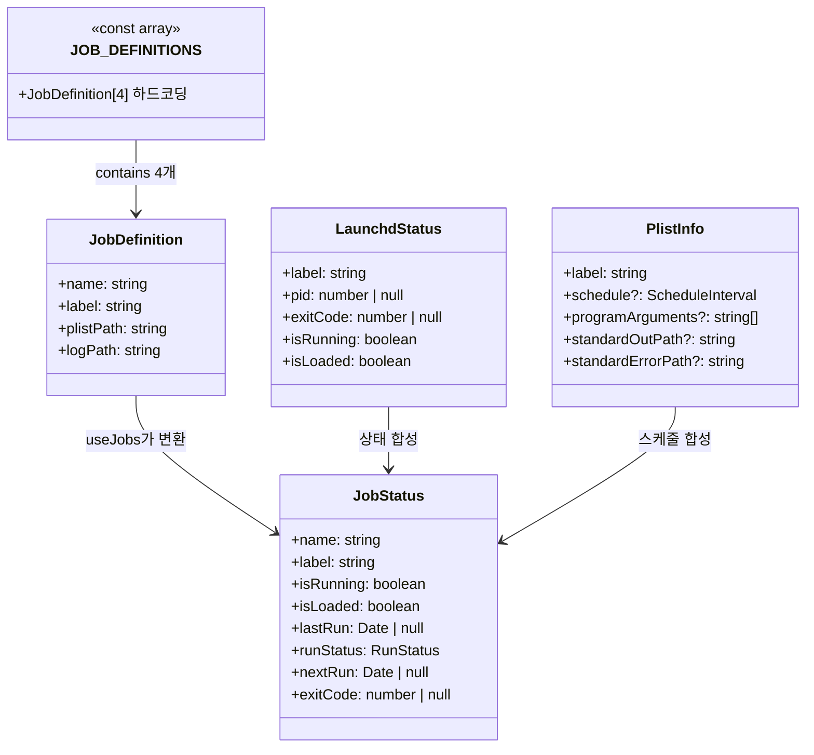
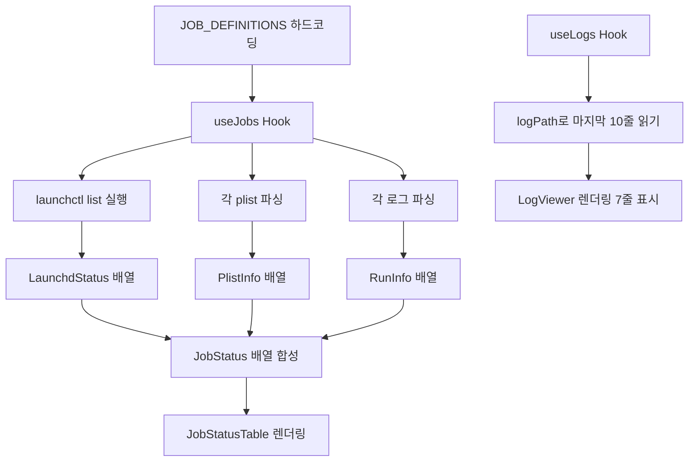
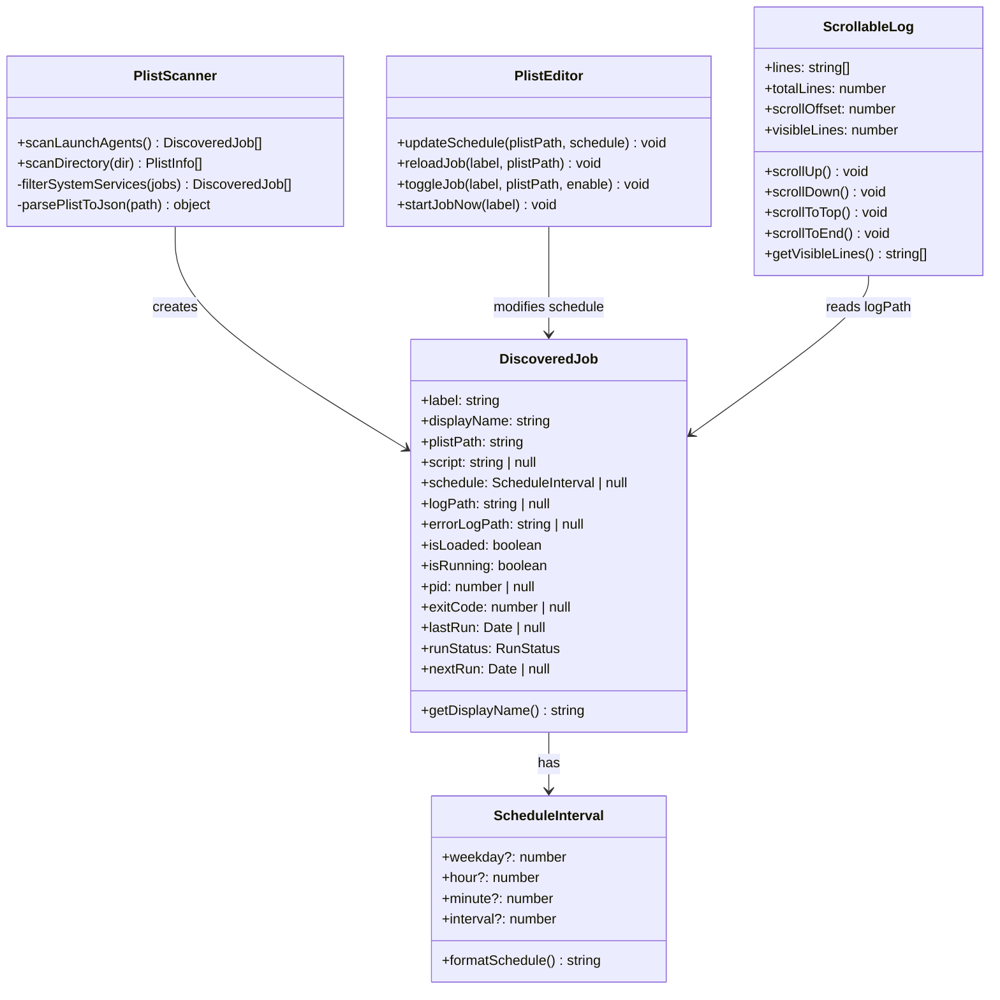
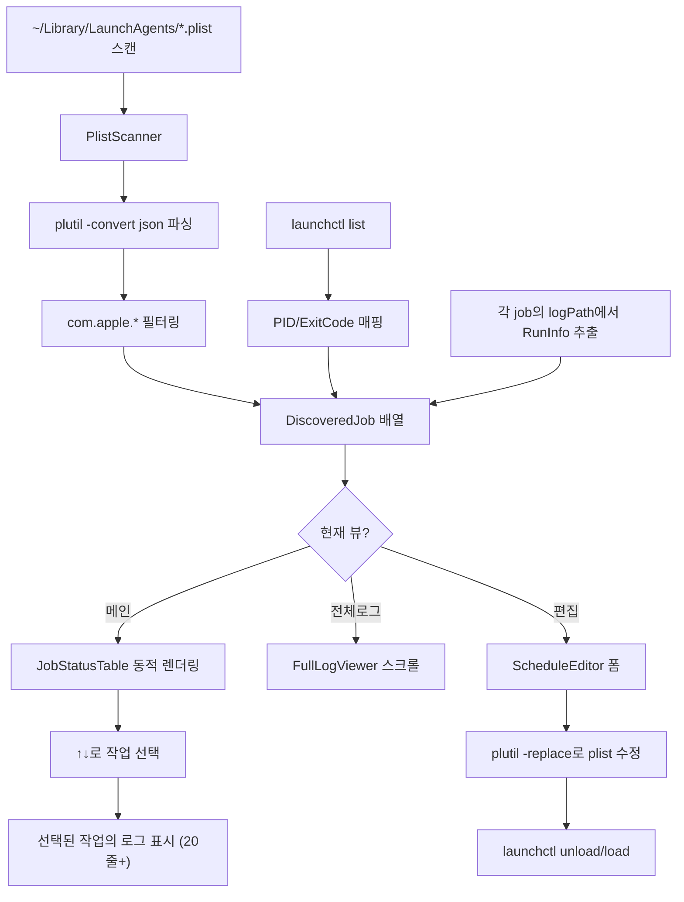
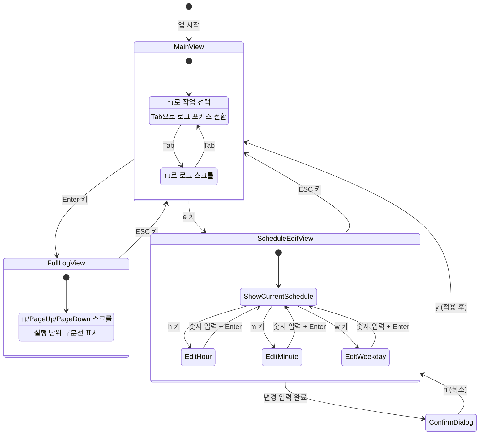
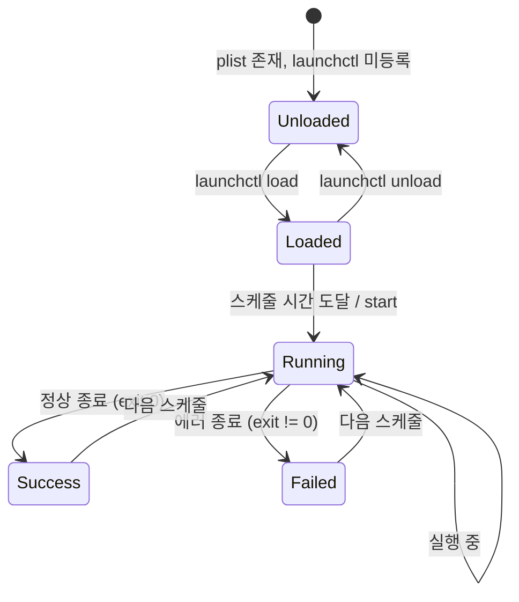
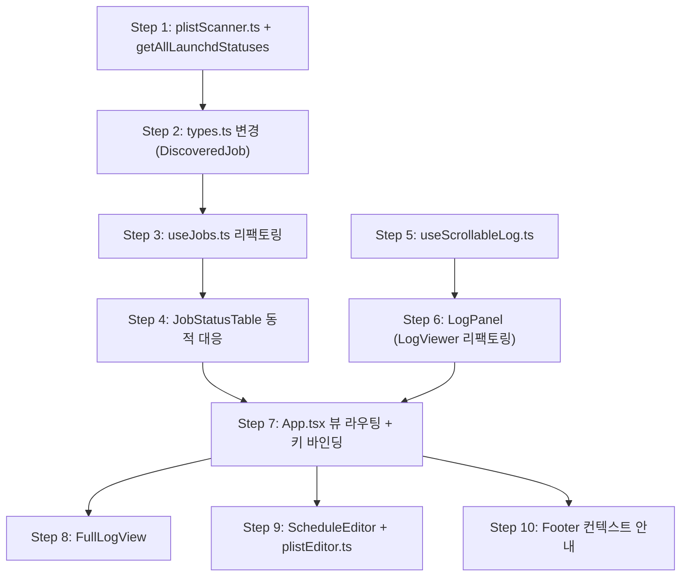

# Dashboard 크론잡 관리 기능 - Design

**날짜**: 2026-02-09
**Feature**: dashboard-cronjob-manager
**Phase**: Design
**Plan 참조**: `docs/01-plan/features/dashboard-cronjob-manager.plan.md`

---

## 1. AS-IS 도메인 모델

### 1.1 현재 클래스 다이어그램



### 1.2 현재 데이터 흐름



### 1.3 현재 문제점

| 영역 | 문제 | 근본 원인 |
|------|------|----------|
| 데이터 소스 | 4개 작업만 표시 | `JOB_DEFINITIONS` 하드코딩 |
| 이식성 | 다른 PC에서 사용 불가 | 절대 경로 고정 |
| 로그 | 마지막 7줄만 표시 | `height=8`, `slice(-7)` |
| 로그 | 과거 히스토리 조회 불가 | 마지막 N줄만 읽는 구조 |
| 스케줄 | 변경 불가 | 읽기 전용 |
| UI | 작업 수 고정 (1-4 키) | 정적 인덱싱 |

---

## 2. TO-BE 도메인 모델

### 2.1 변경 후 클래스 다이어그램



### 2.2 변경 후 데이터 흐름



---

## 3. 상태 다이어그램

### 3.1 대시보드 뷰 상태



### 3.2 작업 상태



---

## 4. 컴포넌트 설계

### 4.1 컴포넌트 트리

```
App
├── InteractiveApp (TTY raw mode)
│   ├── Header (제목, 시간, 총 작업 수)
│   ├── MainView (기본 뷰)
│   │   ├── JobStatusTable (동적 목록, ↑↓ 선택)
│   │   └── LogPanel (스크롤 가능 로그)
│   ├── FullLogView (전체 로그 뷰)
│   │   └── ScrollableLogViewer
│   ├── ScheduleEditView (스케줄 편집 뷰)
│   │   └── ConfirmDialog
│   └── Footer (현재 뷰 기준 단축키 안내)
└── ReadOnlyApp (non-TTY)
```

### 4.2 컴포넌트별 책임

#### `App.tsx` - 뷰 라우터

```typescript
type ViewMode = 'main' | 'fullLog' | 'scheduleEdit';

// 상태 관리
const [viewMode, setViewMode] = useState<ViewMode>('main');
const [selectedJobIndex, setSelectedJobIndex] = useState(0);
const [focusArea, setFocusArea] = useState<'jobs' | 'logs'>('jobs');
```

#### `JobStatusTable` - 동적 작업 목록

- AS-IS: `jobs.map()` + `[${index + 1}]` 고정 인덱스
- TO-BE: `jobs.map()` + ↑↓ 키로 선택, 스크롤 가능 (화면 높이 초과 시)
- 열 너비 조정: label에서 접두사 제거 후 표시 (예: `com.dev-assistant.daily` → `daily`)

#### `LogPanel` (LogViewer 확장)

- AS-IS: `lines.slice(-7)` 고정
- TO-BE: `ScrollableLog` 모델 사용, 50줄 버퍼, ↑↓ 스크롤
- 실행 단위 구분선: `=== ... 시작 ===` 패턴 감지 시 `───` 삽입

#### `FullLogView` (신규)

- 전체 로그 파일을 로드 (최대 500줄)
- ↑↓/PageUp/PageDown 스크롤
- 실행 블록 단위 구분선
- 상단에 작업 이름 + 로그 경로 표시
- ESC로 MainView 복귀

#### `ScheduleEditor` (신규)

- 현재 스케줄 표시: `매일 18:00` 또는 `매주 월요일 09:00`
- `h`: 시간 편집 (0-23 입력)
- `m`: 분 편집 (0-59 입력)
- `w`: 요일 편집 (0-6 입력, 일~토)
- 변경 후 확인 프롬프트 → `plutil` + `launchctl reload`

#### `Footer` - 컨텍스트 단축키

```typescript
// viewMode에 따라 다른 안내 표시
switch(viewMode) {
  case 'main':
    // focusArea === 'jobs'일 때
    "[↑↓] 선택  [Tab] 로그  [Enter] 전체로그  [e] 편집  [r] 새로고침  [q] 종료"
    // focusArea === 'logs'일 때
    "[↑↓] 스크롤  [Tab] 작업목록  [Enter] 전체로그  [q] 종료"
  case 'fullLog':
    "[↑↓] 스크롤  [ESC] 돌아가기"
  case 'scheduleEdit':
    "[h] 시간  [m] 분  [w] 요일  [ESC] 취소"
}
```

---

## 5. 유틸리티 설계

### 5.1 `plistScanner.ts` (신규)

```typescript
// ~/Library/LaunchAgents/*.plist를 스캔하여 DiscoveredJob[] 반환
export async function scanLaunchAgents(): Promise<DiscoveredJob[]> {
  // 1. ~/Library/LaunchAgents/ 디렉토리의 .plist 파일 목록
  // 2. 각 plist를 plutil -convert json -o - 로 JSON 변환
  // 3. JSON에서 Label, ProgramArguments, StartCalendarInterval,
  //    StandardOutPath, StandardErrorPath 추출
  // 4. com.apple.* 패턴 필터링
  // 5. launchctl list로 상태 매칭
  // 6. logPath가 있으면 getLastRunInfo로 실행 정보 추출
}

// 표시 이름 생성: label에서 공통 접두사 제거
export function getDisplayName(label: string): string {
  // "com.dev-assistant.daily" → "dev-assistant.daily"
  // "com.google.GoogleUpdater.wake" → "google.GoogleUpdater.wake"
  // "com.github.facebook.watchman" → "github.facebook.watchman"
}

// 시스템 서비스 필터 패턴
const SYSTEM_PREFIXES = ['com.apple.'];
```

**기존 `parsePlist`과의 관계**:
- 기존 `schedule.ts`의 `parsePlist()`는 이미 `PlistInfo`를 반환
- `plistScanner`는 이를 활용하되, **디렉토리 스캔** + **필터링** + **launchctl 매칭** 레이어 추가
- `parsePlist`는 개별 파일 파싱, `scanLaunchAgents`는 전체 탐색

### 5.2 `plistEditor.ts` (신규)

```typescript
// 스케줄 변경
export async function updateSchedule(
  plistPath: string,
  schedule: ScheduleInterval
): Promise<void> {
  // plutil -replace StartCalendarInterval -json '{"Hour":19,"Minute":0}' <path>
}

// 작업 재로드 (unload + load)
export async function reloadJob(label: string, plistPath: string): Promise<void> {
  // launchctl unload <plistPath>
  // launchctl load <plistPath>
}

// 작업 활성/비활성
export async function toggleJob(
  label: string, plistPath: string, enable: boolean
): Promise<void> {
  // enable: launchctl load <plistPath>
  // disable: launchctl unload <plistPath>
}

// 즉시 실행
export async function startJobNow(label: string): Promise<void> {
  // launchctl start <label>
}
```

### 5.3 `useScrollableLog.ts` (신규 Hook)

```typescript
export function useScrollableLog(logPath: string, bufferSize: number = 100) {
  // 상태
  const [allLines, setAllLines] = useState<string[]>([]);
  const [scrollOffset, setScrollOffset] = useState(0);  // 끝 기준 오프셋

  // 파일에서 마지막 bufferSize줄 로드
  // fs.watch로 실시간 감시

  // 스크롤 함수
  const scrollUp = (count = 1) => { ... };
  const scrollDown = (count = 1) => { ... };
  const scrollToEnd = () => setScrollOffset(0);

  // 화면에 표시할 줄 반환
  const getVisibleLines = (visibleCount: number): string[] => {
    const end = allLines.length - scrollOffset;
    const start = Math.max(0, end - visibleCount);
    return allLines.slice(start, end);
  };

  return { allLines, scrollUp, scrollDown, scrollToEnd, getVisibleLines, isLoading };
}
```

### 5.4 기존 유틸 변경

#### `launchd.ts` 변경

```typescript
// AS-IS: 특정 labels만 조회
export async function getLaunchdStatuses(labels: string[]): Promise<LaunchdStatus[]>

// TO-BE: 추가 함수 - 전체 목록 반환 (labels 필터 없이)
export async function getAllLaunchdStatuses(): Promise<Map<string, LaunchdStatus>>
// → PlistScanner에서 매핑 시 사용
```

#### `schedule.ts` 변경

```typescript
// 기존 parsePlist 유지 (개별 파일 파싱)

// 추가: StartInterval 지원 (Google Updater 등 주기 실행 plist)
export interface ScheduleInterval {
  weekday?: number;
  hour?: number;
  minute?: number;
  interval?: number;  // 추가: StartInterval 값 (초 단위)
}

// 추가: 스케줄 포맷 문자열
export function formatSchedule(schedule: ScheduleInterval): string {
  // { hour: 18, minute: 0 } → "매일 18:00"
  // { weekday: 1, hour: 9, minute: 0 } → "매주 월 09:00"
  // { interval: 3600 } → "1시간 간격"
}
```

#### `logParser.ts` 변경

```typescript
// 기존 함수 유지

// 추가: 실행 블록 구분 기능
export function insertRunSeparators(lines: string[]): string[] {
  // "=== ... 시작 ===" 패턴 앞에 구분선 "─────────" 삽입
}

// 변경: 더 많은 줄 읽기 + 역방향 읽기 최적화
export async function getLastLogLines(
  logPath: string,
  lineCount: number = 100  // 기본값 10 → 100
): Promise<string[]>
```

---

## 6. Hook 변경 설계

### 6.1 `useJobs.ts` 리팩토링

```typescript
// AS-IS
export function useJobs(pollingInterval = 1000) {
  // JOB_DEFINITIONS (하드코딩) 기반
}

// TO-BE
export function useJobs(pollingInterval = 5000) {
  const [jobs, setJobs] = useState<DiscoveredJob[]>([]);

  const refresh = useCallback(async () => {
    const discovered = await scanLaunchAgents();
    setJobs(discovered);
  }, []);

  // 폴링 간격: 1초 → 5초 (launchctl 호출 오버헤드 감소)
  return { jobs, isLoading, lastUpdated, refresh };
}
```

### 6.2 `useLogs.ts` → `useScrollableLog.ts`

기존 `useLogs`는 단순 마지막 N줄 반환 → 새로운 `useScrollableLog`로 대체:
- 더 많은 줄 버퍼링 (100줄)
- 스크롤 오프셋 관리
- 실행 단위 구분선 삽입

---

## 7. types.ts 변경

```typescript
// 삭제
export const JOB_DEFINITIONS: JobDefinition[] = [ ... ];
export interface JobDefinition { ... }
export interface JobStatus { ... }

// 추가
export interface DiscoveredJob {
  label: string;
  displayName: string;
  plistPath: string;
  script: string | null;
  schedule: ScheduleInterval | null;
  logPath: string | null;
  errorLogPath: string | null;
  isLoaded: boolean;
  isRunning: boolean;
  pid: number | null;
  exitCode: number | null;
  lastRun: Date | null;
  runStatus: 'success' | 'running' | 'failed' | 'skipped' | 'unknown';
  nextRun: Date | null;
}

export type ViewMode = 'main' | 'fullLog' | 'scheduleEdit';
export type FocusArea = 'jobs' | 'logs';
```

---

## 8. 구현 순서



**Phase별 매핑**:

| Step | Phase | 파일 | 설명 |
|------|-------|------|------|
| 1-4 | Phase 1 (P0) | plistScanner, types, useJobs, JobStatusTable | 크론잡 자동 탐색 |
| 5-6 | Phase 2 (P0) | useScrollableLog, LogPanel | 로그 뷰어 강화 |
| 7 | Phase 2 (P0) | App.tsx | 뷰 전환 + 키 바인딩 통합 |
| 8 | Phase 3 (P1) | FullLogView | 전체 로그 뷰 |
| 9 | Phase 4 (P1) | ScheduleEditor, plistEditor | 스케줄 편집 |
| 10 | Phase 4 (P1) | Footer | 컨텍스트 안내 |

---

## 9. 테스트 계획

### 9.1 유닛 테스트

| 대상 | 테스트 항목 |
|------|-----------|
| `plistScanner.ts` | plist JSON 파싱, 필터링, displayName 생성 |
| `plistEditor.ts` | plutil 명령 생성, launchctl 명령 생성 |
| `launchd.ts` (추가) | `getAllLaunchdStatuses` 전체 목록 파싱 |
| `schedule.ts` (추가) | `formatSchedule`, `StartInterval` 지원 |
| `logParser.ts` (추가) | `insertRunSeparators` 구분선 삽입 |
| `useScrollableLog` | 스크롤 오프셋 계산, 가시 영역 추출 |

### 9.2 기존 테스트 영향

| 파일 | 영향 |
|------|------|
| `launchd.test.ts` | 유지 + `getAllLaunchdStatuses` 케이스 추가 |
| `schedule.test.ts` | 유지 + `formatSchedule`, `interval` 케이스 추가 |
| `logParser.test.ts` | 유지 + `insertRunSeparators` 케이스 추가 |

---

## 10. 설계 결정 (Design Decisions)

### DD-1: plist 파싱 방식

**선택**: `plutil -convert json -o -` 명령 사용
**대안**: `@plist/parse` 라이브러리 (현재 사용 중)

**이유**: 기존 `@plist/parse`는 잘 동작하지만, 외부 plist(Google, Microsoft 등)의 binary plist 형식을 지원하려면 `plutil`이 더 안정적. 단, 개별 파일 파싱은 기존 `@plist/parse`를 유지하고, 스캐너에서만 `plutil` 사용.

### DD-2: 폴링 간격

**선택**: 5초 (현재 1-3초에서 증가)
**이유**: 동적 스캔은 plist 파일 읽기 + launchctl 실행이 포함되어 오버헤드가 큼. 작업 상태는 초 단위로 변하지 않으므로 5초면 충분.

### DD-3: 로그 버퍼 크기

**선택**: 100줄 (인메모리), 전체 로그는 최대 500줄
**이유**: 터미널 UI 특성상 무한 스크롤 불가. 100줄이면 최근 2-3회 실행 로그를 포함하여 충분한 디버깅 컨텍스트 제공.

### DD-4: 뷰 전환 방식

**선택**: 단일 `viewMode` 상태로 화면 전환
**대안**: 탭 기반 멀티 뷰
**이유**: Ink에서 탭 UI는 복잡도가 높음. 단일 viewMode로 전환하는 것이 구현 단순하고, 키보드 UX도 직관적 (Enter 진입, ESC 복귀).

---

## 11. 완료 조건 (DoD) 대조

| Plan DoD | Design 대응 |
|----------|------------|
| LaunchAgents plist 자동 스캔 | `plistScanner.ts` + `scanLaunchAgents()` |
| com.apple.* 필터링 | `SYSTEM_PREFIXES` 상수 + 필터 함수 |
| launchctl 상태 실시간 표시 | `getAllLaunchdStatuses()` + 5초 폴링 |
| 로그 경로 자동 감지 | plist의 `StandardOutPath` 필드 추출 |
| 로그 20줄+ 표시 | `useScrollableLog(path, 100)` + 가시 영역 계산 |
| ↑↓ 로그 스크롤 | `scrollUp/scrollDown` + focusArea 상태 |
| 실행 단위 구분선 | `insertRunSeparators()` |
| Enter 전체 로그 / ESC 복귀 | `viewMode` 상태 전환 |
| e 키 스케줄 편집 | `ScheduleEditor` + `plistEditor.ts` |
| 하드코딩 제거 | `JOB_DEFINITIONS` 삭제, `DiscoveredJob` 동적 타입 |
| 테스트 | 유닛 테스트 6개 모듈 |
